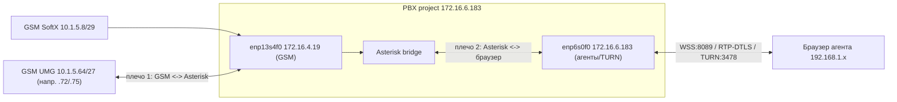

# Звук «туда и обратно»: единый ран-бук (оба плеча RTP)

Цель: добиться двустороннего звука в наушниках агента. Это **единая точка входа** для
диагностики; детальные материалы — в [gsm-rtp-one-way.md](gsm-rtp-one-way.md),
[gsm-network-routes.md](gsm-network-routes.md), [firewall-webrtc-agent.md](firewall-webrtc-agent.md).

## Карта медиа-потока



> **Быстрая локализация одной командой** (на сервере, во время тестового звонка):
> `bash scripts/diag-audio.sh -w 8` — печатает маршрут/`rp_filter`, `pjsip show channelstats`
> (прирост Rx/Tx), наличие `Got RTP` от GSM и от агента, и сразу вердикт по виновному плечу.

Два независимых плеча. Любое одно сломанное плечо = «не слышно» с одной стороны:

| Плечо | Симптом one-way | Где чинить |
| ----- | --------------- | ---------- |
| 1. GSM -> Asterisk | агент **не слышит абонента**; в логах нет `Got RTP ... 10.1.5` (любой хост в `10.1.5.64/27`) | маршрут/`rp_filter` на хосте + **UMG/SBC не шлёт RTP на 172.16.4.19** |
| 1. Asterisk -> GSM | абонент **не слышит агента** | `media_address`/маршрут к `10.1.5.64/27` |
| 2. Asterisk -> браузер | в браузере `in=NO-inbound-rtp` | firewall ПК агента + **межсетевой ACL `172.16.6.131`** |
| 2. браузер -> Asterisk | в логах нет `Got RTP ... 192.168.1.x` | микрофон/HTTPS-контекст браузера |

---

## Шаг 0. Деплой и сверка конфигов на сервере

> **Корень прошлого GSM one-way — старый конфиг на сервере, а не сеть.** GSM-сторона открыта
> (подтверждено их инженером), поэтому **обязателен редеплой** repo-конфига: без `git pull` +
> пересоздания контейнера на сервере останутся старые `media_address`/`localnet`, и плечо 1
> продолжит «молчать» независимо от ACL.

Прошлый снимок (`verify-audio-state.txt`) показывал на сервере **старый** конфиг
(`media_address=172.16.6.183`, `localnet=10.0.0.0/8`), хотя репозиторий уже исправлен.
Поэтому сначала убедиться, что на сервере именно конфиг из репозитория.

```bash
cd /opt/call-center/asterisk-cc-phase1
git pull
docker compose restart asterisk-a
bash scripts/verify-gsm-config.sh        # ждём «GSM config check passed»
```

Сверка ключевых значений **в контейнере** (после подстановки entrypoint):

```bash
docker compose exec -T asterisk-a sh -lc '
  echo "== pjsip_provider =="; grep -E "media_address|bind_rtp|^match=" /etc/asterisk/pjsip_provider.conf
  echo "== rtp.conf =="; grep -E "external_media_address|localnet" /etc/asterisk/rtp.conf
  echo "== agent transport =="; grep -E "external_media_address|external_signaling_address" /etc/asterisk/pjsip.conf
'
```

Ожидаем (после правок этого тикета):
- `pjsip_provider`: `media_address=172.16.4.19`, `bind_rtp_to_media_address=yes`, `match=10.1.5.8/29` и `10.1.5.64/27`.
- `rtp.conf`: `external_media_address=172.16.6.183`, **нет** `localnet=10.0.0.0/8` / `10.1.5.x`.
- `pjsip.conf`: `external_media_address=172.16.6.183` (подставлен из `PUBLIC_DOMAIN`, не литерал `${PUBLIC_DOMAIN}`).

Если видны `${PUBLIC_DOMAIN}` или `${GSM_MEDIA_ADDRESS}` дословно — entrypoint не отработал подстановку: проверить `.env` и перезапустить контейнер.

> С Windows-машины тот же снимок состояния можно собрать удалённо:
> `python scripts/remote-verify-audio-state.py` (требует `CC_DEPLOY_PASS`/`SSH_PASS`).

---

## Шаг 1. Плечо GSM <-> Asterisk

Подробности: [gsm-rtp-one-way.md](gsm-rtp-one-way.md).

```bash
cd /opt/call-center/asterisk-cc-phase1
sudo bash scripts/apply-gsm-routes.sh
# Маршруты — по ПОДСЕТЯМ (не /32): 10.1.5.0/24, 10.1.5.8/29, 10.1.5.64/27 via enp13s4f0
ip r | grep 10.1.5
bash scripts/verify-gsm-config.sh
cat /proc/sys/net/ipv4/conf/enp13s4f0/rp_filter   # 0 или 2 (loose); 1 (strict) может резать ассиметрию
```

Во время тестового звонка — снять трафик на GSM-интерфейсе:

```bash
sudo tcpdump -ni enp13s4f0 net 10.1.5.64/27 and udp -vv -c 40
```

- Видны **In и Out** с `172.16.4.19` -> плечо 1 в порядке, переходить к шагу 2.
- Только **Out** (мы шлём, ответа нет) -> входящий RTP с GSM режется **вне PBX** -> эскалация на GSM/SBC (см. ниже).

После звонка — что Asterisk реально принял от абонента:

```bash
grep "Got  RTP packet from    10.1.5" /var/log/asterisk/full | tail
```

Пусто = голос абонента до Asterisk не дошёл (плечо 1, вход).

### Эскалация на сторону GSM/SBC (если только Out)

Запрос их сисадмину (SoftX/UMG):
> Разрешить и **фактически отправлять** входящий RTP/UDP с медиа-подсети **`10.1.5.64/27`**
> (любой хост UMG внутри **`10.1.5.64/27`** — в SDP `c=` бывает разный IP, не один фиксированный)
> на наш PBX **`172.16.4.19`**, UDP, порты RTP согласно SDP (обычно 10000–20000).
> Сейчас мы шлём RTP в вашу сторону (симметричный RTP, `rtp_symmetric=yes`), но обратного потока
> **`10.1.5.x → 172.16.4.19`** на интерфейсе `enp13s4f0` нет (tcpdump: только Out).
> Кодек согласован: G.711 (PCMA/PCMU).
>
> Дополнительно: в INVITE приходит `Supported: precondition` и `a=des:qos mandatory local sendrecv`.
> Asterisk не поддерживает 3GPP preconditions. Просьба **отключить mandatory preconditions** на
> транке к `172.16.4.19` или настроить UMG отправлять RTP без ожидания precondition latch.

---

## Шаг 2. Плечо Asterisk <-> браузер агента

Подробности и чек-лист firewall: [firewall-webrtc-agent.md](firewall-webrtc-agent.md).

1. UI агента открыть по **HTTPS** (`https://172.16.6.183:9443/agent/`) — на HTTP `getUserMedia`
   и autoplay блокируются браузером, ответа на звонок не будет.
2. Принять самоподписанные сертификаты на `:9443` и `:8089` (`https://172.16.6.183:8089/static/index.html`).
3. На ПК агента (PowerShell **от администратора**) разрешить весь входящий UDP **от** `172.16.6.183`
   (не ограничивать LocalPort — WebRTC использует эфемерные порты):
   ```powershell
   New-NetFirewallRule -DisplayName "CC-Asterisk-RTP-in" -Direction Inbound -Action Allow -Protocol UDP -RemoteAddress 172.16.6.183
   ```
4. Во время звонка в Chrome F12 -> Console смотреть `[CC-RTP]`:
   - `in=` **растёт** -> агент слышит абонента (плечо 2, вход — OK).
   - `in=NO-inbound-rtp` при `out` растущем -> обратный UDP режется на FW ПК агента или на
     межсетевом маршрутизаторе `172.16.6.131`.
5. На сервере проверить, что **микрофон агента** доходит до Asterisk:
   ```bash
   grep "Got  RTP packet from    192.168" /var/log/asterisk/full | tail
   ```

### Эскалация на сеть (если `in=NO-inbound-rtp`)

Запрос сетевику по сегменту `172.16.6.183 <-> 192.168.1.0/24` через `172.16.6.131`:
> Разрешить **двусторонний stateful UDP** между `172.16.6.183` и подсетью агентов
> (`192.168.1.0/24`): порты `10000-20000`, `3478` (TURN), `49160-49200` (TURN relay).
> Отключить **SIP ALG / VoIP helper** на промежуточном FW (ломает RTP).

### Firewall Huawei: проверить **outbound** `packet-filter 3044`

Сетевик подтвердил только **inbound** (interzone `trust -> oam`, `packet-filter 3004 inbound`,
ACL `3004` rule `3067 permit source 192.168.1.103`, 264725 матчей) — это **агент -> сервер**
(микрофон, и так работал). Направление **сервер -> агент** идёт через `packet-filter 3044
outbound`, правила которого не показаны. Именно оно отвечает за `in=NO-inbound-rtp`.

Запрос сетевику (готовый текст):
> Покажите правила, на которые ссылается `firewall interzone trust oam` -> `packet-filter 3044
> outbound`. Нужно подтвердить, что **исходящий** (oam -> trust) UDP от `172.16.6.183` к
> `192.168.1.103` пропускается: порты `10000-20000` (RTP), `3478`, `49160-49200` (TURN).
> Либо подтвердить, что сессии **stateful** и обратный поток на уже открытую сессию не режется
> (у нас `rtp_symmetric=yes`, поэтому ответный RTP идёт на тот же 5-tuple).

### A/B запасной вариант: `AGENT_WEBRTC_MODE=standard`

Если firewall-правки (вкл. `3044 outbound`) подтверждены, а inbound к браузеру так и не
появился — плечо 2 могло упереться в нестандартный профиль `[agent-tpl]`
(`AGENT_WEBRTC_MODE=manual`: `webrtc=no` + ручной DTLS/ICE/`bundle=no`). Профиль теперь
переключается через env без правки конфигов:

```bash
cd /opt/call-center/asterisk-cc-phase1
# A/B: стандартный webrtc=yes (entrypoint сгенерит pjsip_agent_webrtc.conf, cc_api отдаст bundle_policy=max-bundle)
echo "AGENT_WEBRTC_MODE=standard" >> .env      # или поправить существующую строку
docker compose up -d asterisk-a webui          # пересоздаст оба (Asterisk-профиль + браузерный bundlePolicy)
```

1. Жёстко обновить страницу агента (Ctrl+Shift+R), один тестовый звонок.
2. Снова смотреть `[CC-RTP] in=` в Console и `bash scripts/diag-audio.sh` на сервере.
3. Если стало лучше — оставить `standard`. Если хуже (Chrome/Edge теряют inbound при
   `bundle=yes`) — вернуть `AGENT_WEBRTC_MODE=manual` и `docker compose up -d asterisk-a webui`.

> Важно: менять режим **только** одной правкой `AGENT_WEBRTC_MODE` — Asterisk и браузер
> согласуются автоматически (`/api/public/telephony` отдаёт `bundle_policy`).

---

## Критерий «исправлено» (оба плеча)

Во время одного звонка одновременно:

1. На сервере: `grep "Got  RTP packet from    10.1.5" /var/log/asterisk/full` — **есть** строки (абонент -> Asterisk).
2. На сервере: `grep "Got  RTP packet from    192.168" /var/log/asterisk/full` — **есть** строки (агент -> Asterisk).
3. В браузере F12: `[CC-RTP] ... in=50000+ out=50000+ ice=connected` — **оба** счётчика растут.
4. Слышимость: агент слышит абонента **и** абонент слышит агента.

Если 1–2 есть, а 3 нет — проблема только в плече 2 (firewall браузера/сеть).
Если 3 есть, а 1 нет — проблема только в плече 1 (GSM/SBC ACL).
