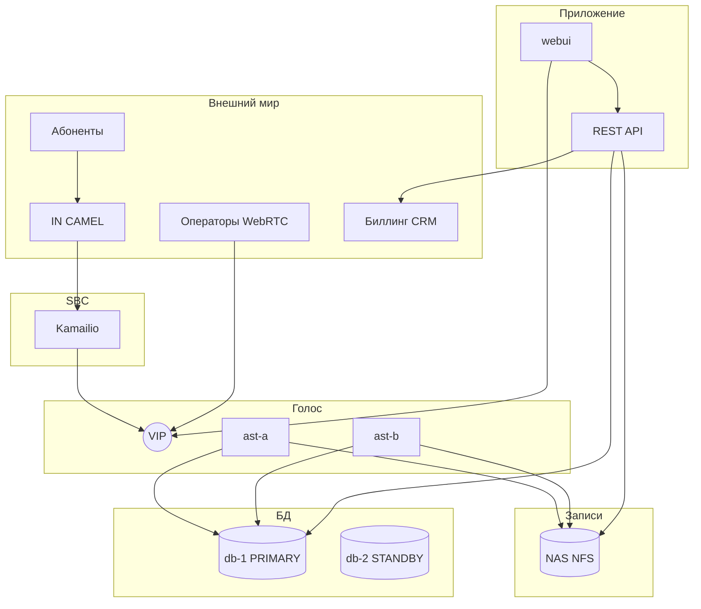

# Техническое задание v1.1  
# Кол-центр Babilon-Mobile на Asterisk (миграция Huawei CSP/IPCC)

| Поле | Значение |
|------|----------|
| Версия | **1.1** |
| Дата | 2026-05-19 |
| Заказчик | Babilon-Mobile (Babilon-M) |
| Исходный стек | Huawei IPCC, CSP 6.0, IVR 2006, Oracle, DataStation |
| Целевой стек | Asterisk 20, PostgreSQL 16, Kamailio, REST API, Web UI, NFS |
| Репозиторий | `C:\Users\ADMIN\CC\asterisk-cc-phase1\` |
| Связанные документы | `docs/KC_functional_overview.md`, `asterisk-cc-phase1/ops/deploy.md` |

---

## Содержание

1. [Цели и границы](#1-цели-и-границы-проекта)
2. [As-Is / To-Be](#2-as-is--to-be)
3. [Архитектура и нагрузка](#3-архитектура-и-нагрузка)
4. [Функциональные требования по фазам](#4-функциональные-требования-по-фазам)
5. [Чек-лист A: интерфейс КЦ (№1–65)](#5-чек-лист-a-интерфейс-для-обслуживания-абонентов-и-call-центра)
6. [Чек-лист B: IVR (№1–11)](#6-чек-лист-b-ivr)
7. [Чек-лист C: мониторинг (№1–20)](#7-чек-лист-c-мониторинг-системы)
8. [Статус готовности](#8-сводный-статус-готовности)
9. [Roadmap и приёмка](#9-roadmap-и-приёмка)

**Легенда в таблицах чек-листов**

| Поддерживается | Смысл |
|----------------|--------|
| **Да** | Реализовано или закрывается Phase 1/1.5 без смены архитектуры |
| **Частично** | Есть задел (конфиг, UI демо, DDL); для prod — API/интеграция |
| **Нет** | Не в scope текущей фазы или отдельный контракт |
| **N/A** | Вне Asterisk-стека / остаётся в смежной системе |

---

## 1. Цели и границы проекта

### 1.1 Цели

1. Заменить голосовое ядро КЦ (Huawei IPCC) на **Asterisk** с сохранением ключевого бизнес-функционала.
2. Обеспечить **запись разговоров** абонент–оператор на **отдельном хранилище (NAS)** с метаданными в PostgreSQL.
3. Веб-рабочие места оператора и супервизора в стиле **CSP** (логин/пароль, не SIP-ID).
4. Заложить основу **KPI (AHT, FCR)** и **QM (оценки, калибровка)**.
5. Мигрировать **IVR линии 2006** (топология `IVR-2006.xlsx`, листы Рус/Тадж/Eng).

### 1.2 Вне scope

- CAMEL / SCP / CBS (IN) — остаётся у оператора связи.
- HedEx/CHM/OVS — справочная документация Huawei.
- DataStation → Oracle как вечная архитектура (допустим dual-run 6–12 мес.).
- Видеозапись экрана оператора, омниканал (Viber/Telegram/чат) — отдельное согласование (см. чек-лист A).

### 1.3 Нагрузка (исходные данные)

| Параметр | Значение |
|----------|----------|
| Операторов (пик) | ~300 |
| Звонков на оператора / день | ~100 |
| Контактов с оператором / день | **~30 000** |
| Вход на IVR 2006 (оценка) | **50 000–90 000** сессий/день |
| Записей / день (~80%) | **~24 000** файлов |
| Диск записей | **~100–200 GB/день**, **~3–6 TB/мес** |
| Postgres (с ретенцией) | **~60–150 GB** рабочий объём |

---

## 2. As-Is / To-Be

### 2.1 As-Is (Huawei)

- IPCC: ICD + CTI, очереди, `.unl` → Oracle (`QueueInfo`, `oplist`, `AgentAssess`, `CallInfo`…).
- IVR 2006: `IVR-2006.xlsx` + VSD (рус/тадж/eng) — топология и тексты.
- CSP 6.0: оператор, Configure (skill, CLI, OpenEye…).
- Записи на серверах IPCC; метаданные в отчётности Oracle.

### 2.2 To-Be (целевое)

| Было | Станет |
|------|--------|
| ICD/CTI | 2× Asterisk + VIP (keepalived) |
| Oracle UIDB | PostgreSQL PRIMARY + STANDBY |
| DataStation | Прямая запись + ETL (переход) |
| Файлы записей | **NAS/NFS** общий для ast-a/ast-b |
| CSP UI | webui + REST API |
| IVR Oracle+xlsx | Postgres `ivr_*` + ARI/AGI |

### 2.3 Состав серверов (production)

| VM | Роль |
|----|------|
| sbc-1 | Kamailio (рекомендуется) |
| ast-a, ast-b | Asterisk active/standby |
| db-1, db-2 | Postgres primary/replica |
| nas-1 | NFS recordings 10–50 TB |
| app-1 | REST API + nginx (webui) |
| mon-1 | Prometheus, Grafana, Loki |

---

## 3. Архитектура и нагрузка

---

## 4. Функциональные требования по фазам

| Фаза | Содержание | Готовность |
|------|------------|------------|
| **Phase 1** | Asterisk, очереди, упрощённый IVR, запись, CDR/CEL, UI демо, admin | ~65% lab |
| **Phase 1.5** | Prod HA, NAS, REST API, бой login, мониторинг ONLINE, принудительные ops | 0% prod |
| **Phase 2** | IVR-2006, биллинг, interactions, MOH admin, multi-CC, uz | 0% |
| **Phase 3** | QM scorecards, FCR, калибровка, Excel-отчёты | 0% |
| **Phase 4+** | Видео экрана, мессенджеры, чат | вне scope |

---

## 5. Чек-лист A: Интерфейс для обслуживания абонентов и Call-центра

> Источник: таблица заказчика «Интерфейс для обслуживания абонентов и Call-центра» (65 пунктов).  
> Пункты **№15** и **№19** выделены в исходнике заказчиком.  
> Декомпозиция согласована с группами требований; при расхождении с Excel заказчика приоритет у исходной таблицы.

| № | Требование заказчика | Поддерживается | Ответ исполнителя |
|---|----------------------|----------------|-------------------|
| 1 | Поддержка всех видов браузеров для веб-интерфейса | Частично | UI на HTML5/JS; WebRTC: Chrome/Edge/Firefox — тесты в Phase 1.5; Safari — отдельная матрица |
| 2 | Исходящие вызовы из интерфейса оператора | Частично | Кнопка Call Out в UI; бой: SIP.js + dialplan; Phase 1.5 |
| 3 | Перевод вызова на группу (очередь) | Частично | Transfer в UI; AMI/ARI QueueTransfer; Phase 1.5 |
| 4 | Перевод вызова на IVR | Частично | После IVR-2006 ARI; Phase 2 |
| 5 | Перевод вызова на конкретного оператора | Частично | Refer/transfer; Phase 1.5 |
| 6 | Постановка вызова на удержание (Hold) | Частично | UI Hold; CEL hold; полная связка — Phase 1.5 |
| 7 | Отключение микрофона (Mute) | Частично | UI Mute; Phase 1.5 |
| 8 | Чёрный список: добавление номеров | Нет | Таблица `blacklist` + admin + dialplan; Phase 2 |
| 9 | Чёрный список: редактирование | Нет | Phase 2 |
| 10 | Чёрный список: удаление | Нет | Phase 2 |
| 11 | Автораспределение по загрузке операторов | Да | `app_queue`, стратегии, penalty |
| 12 | Автораспределение по статусу оператора | Да | Pause/Unpause, не принимать в PAUSE |
| 13 | Прослушивание записей разговоров | Частично | WAV на NAS; supervisor UI демо; API stream — Phase 1.5 |
| 14 | Скачивание записей (WAV/MP3) | Частично | WAV есть; MP3 — transcode по запросу; Phase 1.5 |
| 15 | **Принудительные операции** (принудительный перевод/завершение/вмешательство) | Частично | Barge/whisper ChanSpy; принудительный transfer/hangup — AMI API supervisor; Phase 1.5 |
| 16 | Мониторинг активных звонков (прослушивание в реальном времени) | Частично | ChanSpy *33; supervisor; Phase 1.5 |
| 17 | Шёпот супервизора (whisper) | Частично | ChanSpy *34; Phase 1.5 |
| 18 | Вмешательство в разговор (barge) | Частично | ChanSpy; Phase 1.5 |
| 19 | **Неудавшийся исходящий вызов** (уведомление оператору) | Частично | CDR disposition; UI toast + `audit_log`; Phase 1.5 |
| 20 | **Видеозапись экрана оператора** | Нет | Вне scope Asterisk-КЦ; отдельный DLP/screen recorder по отдельному ТЗ |
| 21 | Хранение истории звонков на сервере | Частично | `cdr` + UI history; Phase 1.5 API |
| 22 | Хранение записей на сервере | Частично | NAS + `recordings`; prod NAS — Phase 1.5 |
| 23 | Добавление учётных записей операторов | Частично | Admin UI; prod: Postgres `agents` |
| 24 | Редактирование операторов | Частично | Admin UI |
| 25 | Удаление / отключение операторов | Частично | status=disabled в admin |
| 26 | Управление ролями | Частично | `roles.json`; prod: RBAC в API |
| 27 | Управление правами доступа | Частично | permissions в roles; API enforcement — Phase 1.5 |
| 28 | Управление группами | Частично | Admin groups; `groups.json` |
| 29 | Статусы оператора: свободен (Ready) | Да | `agent_state_log`, UI |
| 30 | Статусы: занят (Busy) | Да | По событию звонка |
| 31 | Статусы: перерыв (Pause) с причиной | Частично | Pause queue member; справочник причин — Phase 2 |
| 32 | Статусы: обед / личный перерыв | Частично | Как pause reason |
| 33 | After-call work (постобработка) | Частично | AFTERCALL в state log; wrap-up форма — Phase 2 |
| 34 | Журнал входа: ID, login, время | Частично | `auth_log`; Phase 1.5 API |
| 35 | Журнал: IP-адрес клиента | Частично | Добавить в `auth_log`; Phase 1.5 |
| 36 | Журнал: длительность сессии | Частично | Phase 1.5 |
| 37 | Журнал действий оператора в системе | Частично | `audit_log`; расширение — Phase 2 |
| 38 | Интеграция с CRM | Частично | AGI lookup; карточка демо; API CRM — Phase 2 |
| 39 | Отображение данных абонента из CRM | Частично | CSP-поля в UI |
| 40 | Отправка SMS из интерфейса | Частично | Send SMS в UI; SMPP-шлюз — Phase 2 |
| 41 | Шаблоны SMS | Нет | Phase 2 |
| 42 | Интеграция с Mail sender | Нет | Phase 3 / отдельный сервис |
| 43 | Интеграция с Viber | Нет | Омниканал Phase 4+ |
| 44 | Интеграция с Telegram | Нет | Омниканал Phase 4+ |
| 45 | Онлайн-консультант / веб-чат | Нет | Отдельный продукт |
| 46 | Экспорт отчётов в Excel | Частично | Экспорт JSON каталога; SQL→xlsx API — Phase 2 |
| 47 | Отчёт: статистика звонков | Частично | Grafana + SQL views |
| 48 | Отчёт: эффективность операторов | Частично | `agent_state_log`, queue_log; Phase 2 |
| 49 | Отчёт: история контактов | Частично | UI history + CDR |
| 50 | Визуализация: графики и диаграммы | Частично | Grafana; supervisor charts — Phase 2 |
| 51 | Учёт входа/выхода операторов (In/Out) | Частично | state_log LOGIN/LOGOUT; Phase 1.5 |
| 52 | Учёт времени перерывов | Частично | PAUSE intervals в state_log |
| 53 | Хранение информации о клиенте | Частично | Карточка + CRM |
| 54 | Аналитические показатели по клиенту | Частично | Phase 2 KPI |
| 55 | Управление сценариями IVR | Частично | Admin ivr nodes — Phase 2 |
| 56 | Перевод абонента в IVR из разговора | Частично | Phase 2 |
| 57 | Настройка приветствия (greeting) | Частично | Playback/MOH; admin upload — Phase 2 |
| 58 | Озвучивание позиции в очереди | Частично | `periodic-announce` в queues.conf |
| 59 | Фильтр истории по дате | Частично | UI history; API query |
| 60 | Фильтр по оператору | Частично | Phase 1.5 |
| 61 | Фильтр по номеру телефона | Частично | Phase 1.5 |
| 62 | Фильтр по очереди / skill | Частично | Phase 1.5 |
| 63 | Карточка обращения (Service Request) | Частично | UI вкладки; БД tickets — Phase 2 |
| 64 | Каталог услуг / типов обращений | Частично | `services_catalog.json` + импорт/экспорт |
| 65 | Единый вход по логину и паролю (не SIP extension) | Частично | Portal + session; prod LDAP/API — Phase 1.5 |

---

## 6. Чек-лист B: IVR

> Источник: «IVR — Интерфейс для обслуживания абонентов в Call-центре» (11 пунктов + пустые 12–13).

| № | Требование заказчика | Поддерживается | Ответ исполнителя |
|---|----------------------|----------------|-------------------|
| 1 | Поддержка всех видов браузеров (админка/мониторинг IVR) | Частично | Веб-админка; тест-матрица браузеров Phase 1.5 |
| 2 | Учёт общего количества звонков на все типы IVR | Частично | CDR по DID 2006; отчёт `ivr_sessions` — Phase 2 |
| 3 | Несколько call-центров и групп (основной, для организаций, по языкам) | Частично | Группы в admin; сущность `call_centers` — Phase 2 |
| 4 | Неограниченное число учётных записей операторов | Да | Postgres `agents`; лимит — только железо |
| 5 | Неограниченное число операторов online одновременно | Да* | *В расчёте ТЗ 300 операторов; масштабирование — capacity plan |
| 6 | Создание интерактивного и информационного IVR | Частично | Информационный — Playback; интерактивный — IVR-2006 Phase 2 |
| 7 | Добавление/изменение/удаление музыки на удержании | Частично | MOH Asterisk; веб-загрузка MOH — Phase 2 |
| 8 | Гибкая настройка КЦ: лимит звонков, время ожидания в очереди, по группам | Частично | `queues.conf`; UI admin очередей — Phase 2 |
| 9 | Оператор выбирает: обслуживать все КЦ или конкретный | Частично | Select skill queues + `pick_skills`; multi-CC — Phase 2 |
| 10 | Мультиязычность IVR и КЦ: тадж., рус., англ., **узб.** | Частично | xlsx: 3 языка; **узбекский** — добавить лист и промпты Phase 2 |
| 11 | Интеграция IVR с биллингом: баланс, КЭО, услуги, ресурсы, дата/время | Частично | Топология `IVR-2006.xlsx` (ветки b/c/d); REST API биллинга — **критично Phase 2** |
| 12 | *(резерв в исходной таблице)* | — | — |
| 13 | *(резерв в исходной таблице)* | — | — |

---

## 7. Чек-лист C: Мониторинг системы

> Источник: «Мониторинг Системы» (20 пунктов, режим ONLINE).

| № | Требование заказчика | Поддерживается | Ответ исполнителя |
|---|----------------------|----------------|-------------------|
| 1 | Поддержка всех видов браузеров | Частично | Supervisor dashboard web; Phase 1.5 |
| 2 | Отображение даты и времени на главном мониторе | Да | Виджет в supervisor UI |
| 3 | Среднее время ожидания в режиме ONLINE | Частично | `mv_queue_calls_5m.asa`; API realtime Phase 1.5 |
| 4 | Среднее время ожидания необслуженных абонентов ONLINE | Частично | queue_log ABANDON; SQL view |
| 5 | Среднее время разговора ONLINE | Частично | AHT talk в MV; полный AHT — Phase 2 |
| 6 | Обслужено автоматически (IVR) ONLINE | Частично | CDR без CONNECT к оператору; Phase 2 |
| 7 | Обслужено операторами ONLINE | Частично | queue_log CONNECT; API |
| 8 | Всего звонков за 24 часа | Частично | `SELECT count(*) FROM cdr`; виджет API |
| 9 | Всего звонков за месяц | Частично | Партиции cdr |
| 10 | Операторов в системе ONLINE | Частично | AMI + registrations |
| 11 | Всего подключённых пользователей к системе ONLINE | Частично | SIP registrations + web sessions |
| 12 | Операторов на перерыве ONLINE | Частично | QueueMemberPause / state_log |
| 13 | Звонков в очереди ONLINE | Частично | `v_queue_realtime` / AMI QueueStatus |
| 14 | Всего операторов в статусе «занято» ONLINE | Частично | BUSY + device state |
| 15 | Отображение дежурных техников (корректировка отображения) | Нет | Справочник `display_groups` + RBAC; Phase 2 |
| 16 | Отображение системников (корректировка отображения) | Нет | Phase 2 |
| 17 | Отображение операторов по детализации | Частично | Agents grid; фильтры — Phase 2 |
| 18 | Отображение руководителей смены | Нет | Роль supervisor на wallboard; Phase 2 |
| 19 | Максимальная задержка ответа (время в очереди до ответа) + среднее | Частично | queue_log hold_seconds max/avg |
| 20 | Количество исходящих вызовов за текущий день | Частично | CDR по направлению; виджет API |

---

## 8. Сводный статус готовности

### 8.1 По модулям проекта

| Модуль | Готово | Частично | Нет |
|--------|--------|----------|-----|
| Asterisk voice (очереди, запись, CTI) | 40% | 45% | 15% |
| Postgres DDL / ETL scripts | 20% | 55% | 25% |
| Web UI (agent/supervisor/admin) | 10% | 55% | 35% |
| IVR-2006 | 0% | 5% | 95% |
| Prod infra (HA, NAS, SBC) | 0% | 30% | 70% |
| REST API боевой | 0% | 10% | 90% |
| Чек-лист A (65) | ~12% «Да» | ~58% «Частично» | ~30% «Нет» |
| Чек-лист B (11) | ~25% | ~65% | ~10% |
| Чек-лист C (20) | ~5% | ~80% | ~15% |

### 8.2 Артефакты уже в репозитории

| Артефакт | Путь |
|----------|------|
| Asterisk configs | `asterisk-cc-phase1/asterisk/etc/` |
| Postgres SQL | `asterisk-cc-phase1/postgres/sql/` |
| Web UI | `asterisk-cc-phase1/webui/` |
| Deploy / runbook | `asterisk-cc-phase1/ops/` |
| Функциональный обзор Huawei | `docs/KC_functional_overview.md` |
| **Это ТЗ** | **`docs/TZ_Full_v1.1.md`** |

### 8.3 Критичный путь до production

1. Prod: ast-a/b + VIP + db-1/2 + **NAS** + Kamailio  
2. REST API: auth, recordings, queues realtime, monitoring  
3. IVR-2006 + биллинг API  
4. `interactions` + KPI  
5. Приёмка по `asterisk-cc-phase1/tests/acceptance_tests.md`

---

## 9. Roadmap и приёмка

| Фаза | Срок (ориентир) | Результат |
|------|-----------------|-----------|
| Phase 1 | Выполнено ~65% lab | Стенд docker-compose |
| Phase 1.5 | 4–8 нед | Prod + API + NAS + чек-листы A/C ONLINE |
| Phase 2 | 8–12 нед | IVR-2006, биллинг, чек-лист B, MOH, multi-CC |
| Phase 3 | 8–12 нед | QM, FCR, Excel, AgentAssess migration |

### Критерии приёмки prod (кратко)

- 300 операторов WSS, приём из очередей  
- ≥80% записей на NAS + строка в `recordings`  
- Failover ast-a ↔ ast-b  
- Чек-лист C п.3–14 на supervisor dashboard (ONLINE)  
- Чек-лист A п.65: вход по login/password  

---

## Приложение: подсчёт ответов для Excel заказчика

Для переноса в колонку «Поддерживается исполнителем»:

| Значение в ТЗ | Писать в Excel |
|---------------|----------------|
| Да | **да** |
| Частично | **да*** (с оговоркой в «Ответ исполнителя») или **частично** — по согласованию |
| Нет | **нет** |
| N/A | **н/п** |

---

*Документ подготовлен на основе: `asterisk-cc-phase1`, документации Huawei CSP/IPCC, IVR-2006.xlsx, чек-листов заказчика (скрины 2026-05-19), расчёта 300×100 звонков/день.*
